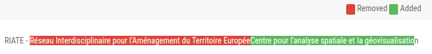
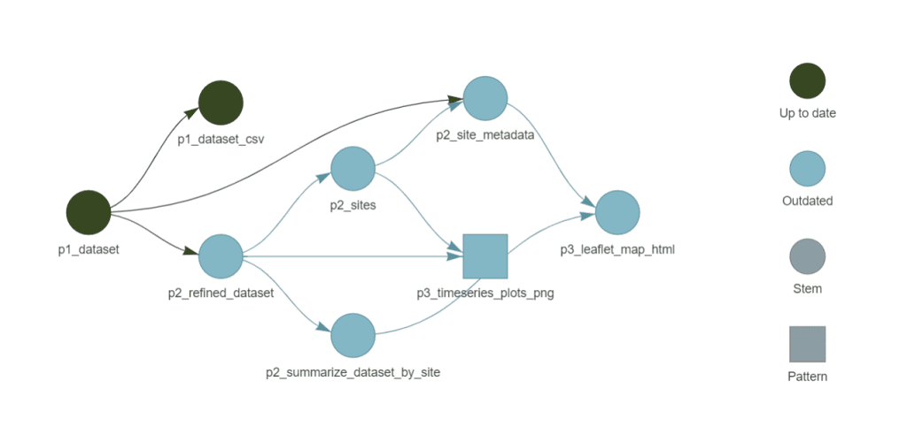
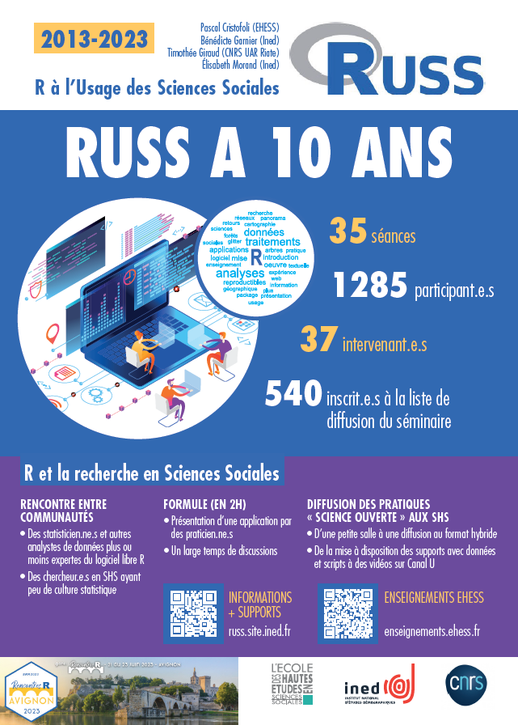

## Présentation rapide du RIATE 🎯

:::{.center}
{.w300}
:::

Une petite équipe :

- 1 directeur (PR Univ. Paris Cité) 

- 5 ingénieur·es permanent·es (CNRS et Univ. Paris Cité)

- 2 ingénieurs en CDD (+ stagiaires)

 

Une **_Unité d'Appui et de Recherche_** [(dont le nom a évolué en 2024)]{.fragment}

:::{.fragment}

:::

<!-- ## Le RIATE en quelques dates

:::{.fragment}
- Unité **créée en 2002** sous la cotutelle du **CNRS**,
  de la Délégation à l’Aménagement du Territoire et l’Action Régionale (**DATAR**) et de l’**Université Paris 7 - Denis Diderot**
:::

:::{.fragment}
- Initialement un **rôle de coordination pour le lancement des projets de recherche du programme ESPON**
:::

:::{.fragment}
- **2019-2020** : retrait du CGET (ex-DATAR) des tutelles, fin du rôle de Point de Contact National du programme ESPON
  et **recentrage des missions du RIATE vers la production et la diffusion de méthodes et d’outils en géographie quantitative**
:::

:::{.fragment}
- **2024** : Renommage en **RIATE - Centre pour l’analyse spatiale et la géovisualisation**
:::

-->

## Objectifs du RIATE

 

:::{.center}

__*Le RIATE, une UAR avec la transmission au cœur de ses missions*__

:::

 

Mission 1 : **Développement de méthodes et d’outils en géographie quantitative**

 

Mission 2 : **Diffusion et partage des savoir-faire et des connaissances**

 

Mission 3 : **Partenariats scientifiques**

## La science ouverte au RIATE

- **Participation à des projets de recherche** en mettant en œuvre des protocoles permettant la **reproductibilité** des recherches
  (c'est le cas sur l'ensemble des projets de recherche conduits par le RIATE)

&nbsp;

- **Développement et publication d’outils libres et open source** (l'intégralité des outils développés par le RIATE est
  diffusée sous licence libre — principalement licence MIT ou licence GPL v3)

&nbsp;

- **Initiatives en faveur de la diffusion de savoir-faire et de connaissances** (RZine, écoles thématiques, publication de supports, etc.)

## Projets de recherche : Méthodes pour une production scientifique ouverte

 

Mise en œuvre des méthodes de la recherche reproductible :

- **Gestion de versions** (Git, GitHub / GitLab, etc.)

- **Automatisation des analyses** (scripts, notebooks, etc.)

- **Documentation des analyses** (littératie des données, métadonnées, etc.)

- **Partage des données** (dépôts de données et des codes, licences ouvertes, etc.)

:::{.notes}

Ou "culture des données"

:::

## Projets de recherche : Méthodes pour une production scientifique ouverte

:::{.center}

{.w700 .bordered}

<small>Formalisation de la chaîne de traitement reproductible avec `{targets}`</small>

:::

## Projets de recherche : Diffusion des résultats

:::: {.columns}

::: {.column .center .fragment width="50%"}

<small>Publication de jeux de données et codes sur Zenodo</small>

:::

::: {.column .center .fragment width="50%"}

{.bordered}

<small>Exemple de notebook accompagnant un jeu de données</small>

:::

::::

:::{.notes}

Projet GRANULAR : Giving Rural Actors Novel data and re-Useable tools to Lead public Action in Rural areas
(projet visant à donner aux acteurs ruraux des données originales et des outils réutilisables pour piloter l'action publique)

Utilisation de techno comme quarto pour la production de documents dynamiques mêlant texte, code et visualisations
comme sur le notebook ci-dessus.

:::

## Projets de recherche : Diffusion des résultats

:::{.center}

<small><em>Data paper</em></small>

:::

## Projets de recherche : Diffusion des résultats

:::{.center}

{.bordered .w800}

<small>Au-delà des publications scientifiques, via sites Web dédiés par exemple</small>

:::

:::{.notes}

Projet visant à documenter la diffusion spatio-temporelle des locations de courte durée Airbnb dans la région parisienne.

Poursuivit actuellement dans le cadre du projet Geoviz-LCD.

:::

## Développement d'outils

 

**_Riatelab_** : l'activité de développement d'outils open source

:::{.medium}

 

Des développements guidés par :

- la volonté de diffusion des méthodes de cartographie utilisées par le RIATE
- les besoins des projets de recherche auxquels participent des membres du RIATE

 

Mise en œuvre **des bonnes pratiques de développement logiciel** (*versioning* et notes de release, tests, documentation, etc.)

 

*➟ Plus de 20 projets actuellement maintenus*

:::

## Développement d'outils

 

Inscription dans la **dynamique de valorisation des logiciels produits par/pour des organismes publics**
(code.gouv.fr, SILL, Catalogue des logiciels libres de la recherche académique, etc. – en cours 😅)

 

:::{.center}
{.w700}
:::

:::{.fragment}

:::

:::{.notes}

Le COSO (comité pour la science ouverte) assure la mise en œuvre de la politique nationale de science ouverte.

:::

## Développement d'outils : packages R

:::{.center}
{.w900}
:::

## Développement d'outils : packages R

 

- **Publiés sur le CRAN et/ou Runiverse** (+ code source sur GitHub)

 

- Des "vignettes" couvrant l'usage des packages, mais aussi des tâches
  préalables parfois bloquantes pour certains utilisateurs (installation de moteur de recherche d'itinéraire
  comme OSRM ou Valhalla, etc.)

## Développement d'outils : packages R

Exemple combinant plusieurs packages R développés par le RIATE

- **maposm** : récupération de couches extraites d'OpenStreetMap

- **valh** : calcul d'itinéraire (client pour l'API de Valhalla)

- **distanamo** : cartogramme de distance

- **mapsf** : cartographie

<!--  -->

:::{.center}

{.w600}

:::

## Développement d'outils : bibliothèques JavaScript

:::{.center}
{.w600}
:::

## Développement d'outils : bibliothèques JavaScript

- Bibliothèques publiées sur *npm* (+ code source sur GitHub)

- De nombreux notebooks et exemples d'utilisation sur la plateforme [Observable](https://observablehq.com/)

:::{.center}
{.w800}
:::

## Développement d'outils : Magrit

:::{.center}
{.w300}
:::

**Application Web de cartographie thématique**, développée **depuis 2017** (le projet open source avec la plus
longue durée de vie au RIATE)

Utilisée pour l'**enseignement** et l'**apprentissage** de la cartographie, principalement à l'université

## Développement d'outils : Magrit

:::{.center}
{.w1000}
:::

## Développement d'outils : Varia

 

- Plugin QGIS, bibliothèques Rust ou Python, etc.

- Contribution à des projets open source externes

- Et bien sûr, **des outils en cours de développement au sein de projets de recherche** 🕵️

:::{.center}
{.w700}
:::

## Initiatives pour la diffusion des connaissances

*Un rôle moteur dans différentes initiatives*

:::{.medium}

- **RZine** ([https://rzine.fr/](https://rzine.fr/)) 

- **ElementR** ([https://elementr.cnrs.fr/](https://elementr.cnrs.fr/))

- **Séminaire RUSS** (R à l'usage des sciences sociales)

- Mise à disposition de supports sous licence libre (CC-BY-SA)
  ([Géomatique et cartographie avec R](https://rgeocarto.github.io/), [Théorie cartographie thématique + Magrit](https://magrit-formation.github.io/), (Géo)Visualisation en JavaScript, etc.)

:::

:::{.center}
{.w600}

:::

:::{.notes}

RZine : des publications méthodologiques pour les SHS avec l'objectif est de présenter des méthodes de collecte,
de traitement, d’analyse ou de représentation de données, mises en application avec le langage R.
Publications en accès libre, soumises à une évaluation ouverte par les pairs, sous forme d'article exécutables (notebooks).

ElementR : groupe pour l’apprentissage et la montée en compétence collective dans la pratique du traitement de l’information géo. avec R

:::

## Initiatives pour la diffusion des connaissances

*Formation à la science ouverte et aux bonnes pratiques de la recherche reproductible*

- École thématique [**SIGR** (Sciences de l'information géographique reproductibles)](https://sigr2020.sciencesconf.org/index.html) - **2023**

- École thématique [**SO-SHS** (Sciences ouvertes pour les SHS : scripts, codes et logiciels)](https://so-shs.gitpages.huma-num.fr/) - **2025**

:::{.center}
{.w600}
:::

## Initiatives pour la diffusion des connaissances

*Une implication nationale et internationale*

 

- Implication dans des réseaux métiers (MAGIS, COSO, MATE-SHS, etc.), participation semaines DATA-SHS, etc.

 

- Solicitations pour intervenir dans des écoles thématiques (Bénin, Cambodge, Sénégal, Tunisie, etc.)

## Quel état de la diffusion réalisée par le RIATE ?

Bénéfices du choix de **méthodes reproductibles** :

- Des échanges facilités entre les chercheur·es et les ingénieur·es

- Des résultats faciles à diffuser et à réutiliser

- Une expertise reconnue en géographie quantitative et en conduite de projets

:::{.center}
{.w300}
:::

## Quel état de la diffusion réalisée par le RIATE ?

Bénéfices du choix des **logiciels libres** :

- Une **large diffusion des outils** (communauté d'utilisateurs internationale), des retours d'expérience et des rapports de bugs facilités

- Des **usages au-delà de la communauté _recherche_** (enseignement secondaire, collectivités territoriales, associations, hobbyistes, etc.)

:::{.center}
{.w600}
:::

## 

:::::{.center}

### Merci !

::::{.left}

  

Nous retrouver 👋

- **UAR RIATE** - [https://riate.cnrs.fr](https://riate.cnrs.fr) / [riate@cnrs.fr](mailto:riate@cnrs.fr)

- **Principaux dev. open source** - [https://github.com/riatelab](https://github.com/riatelab)

:::{.medium-small}

Présentation disponible sur <a href="https://riatecom.github.io/jjc-magis-2025/" target="_blank">https://riatecom.github.io/jjc-magis-2025/</a>
:::

::::
:::::