## Présentation rapide du RIATE 🎯

:::{.center}
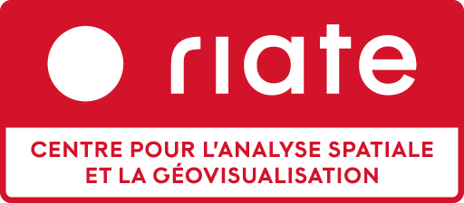{.w300}
:::

Une petite équipe :

- 1 directeur (PR Univ. Paris Cité)

- 5 ingénieur·es permanent·es (CNRS et Univ. Paris Cité)

- 2 ingénieurs en CDD (+ stagiaires)

 

Une **_Unité d'Appui et de Recherche_**

## Le RIATE en quelques dates

- Unité **créée en 2002** sous la cotutelle du **CNRS**,
  de la Délégation à l’Aménagement du Territoire et l’Action Régionale (**DATAR**) et de l’**Université Paris 7 - Denis Diderot**

- Initialement un **rôle de coordination pour le lancement des projets de recherche du programme ESPON**

- **2019-2020** : retrait du CGET (ex-DATAR) des tutelles de l'unité, fin du rôle de Point de Contact National du programme ESPON
  et **recentrage des missions du RIATE vers la production et la diffusion de méthodes et d’outils en géographie quantitative**

- **2024** : Renommage en **RIATE - Centre pour l’analyse spatiale et la géovisualisation**

## Objectifs du RIATE

 

:::{.center}
__*Le RIATE, une UAR avec la transmission au cœur de ses missions*__
:::

 

Mission 1 : **Développement de méthodes et d’outils en géographie quantitative**

 

Mission 2 : **Diffusion et partage des savoir-faire et des connaissances**

 

Mission 3 : **Partenariats scientifiques**

## La science ouverte au RIATE

- **Participation à des projets de recherche** en mettant en œuvre des protocoles permettant la **reproductibilité** des recherches
  (c'est le cas sur l'ensemble des projets de recherche conduits par le RIATE)

 

- **Développement et diffusion d’outils libres et open source** (l'intégralité des outils développés par le RIATE est
  diffusée sous licence libre — principalement licence MIT ou licence GPL v3)

 

- **Diffusion de savoir-faire et de connaissances** (supports de formation, tutoriels, etc.)

## Projets de recherche : Méthodes pour une production scientifique ouverte

Mise en œuvre des méthodes de la recherche reproductible :

- **Gestion de versions** (Git, GitHub, GitLab, etc.)

- **Automatisation des analyses** (scripts, notebooks, etc.)

- **Documentation des analyses** (littératie des données, métadonnées, etc.)

- **Partage des données** (dépôts de données et des codes, licences ouvertes, etc.)

## Projets de recherche : Diffusion des résultats

:::: {.columns}

::: {.column .center width="50%"}

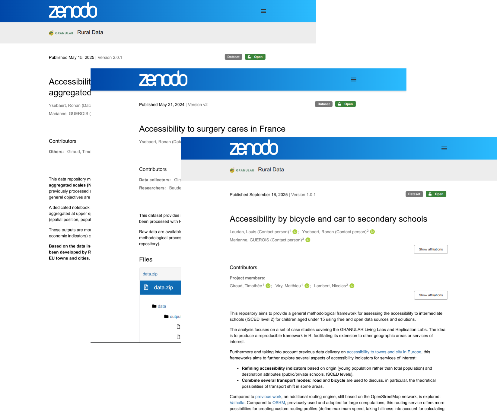

<small>Publication de jeux de données et codes sur Zenodo</small>

:::

::: {.column .center width="50%"}

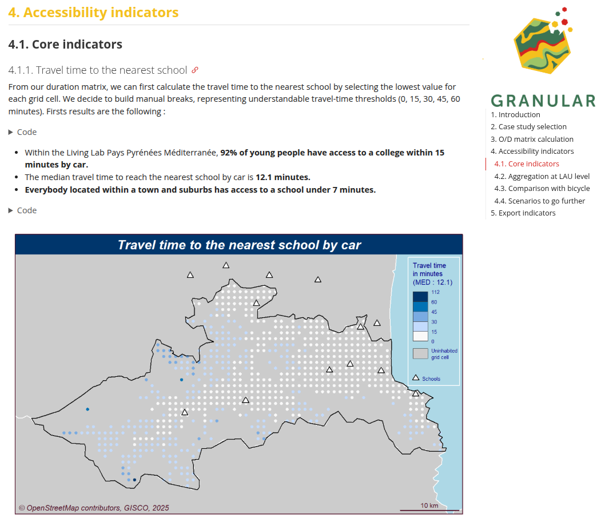{.bordered}

<small>Exemple de notebook accompagnant un jeu de données</small>

:::

::::

## Projets de recherche : Diffusion des résultats

:::{.center}

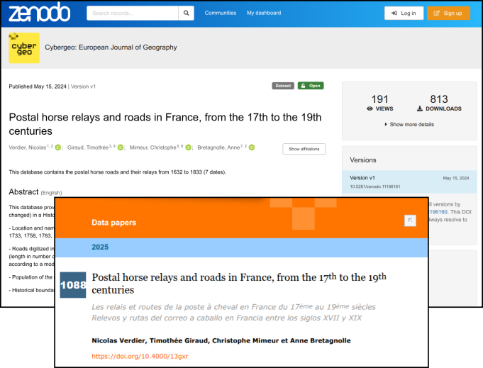

<small><em>Data paper</em></small>

:::

## Projets de recherche : Diffusion des résultats

:::{.center}

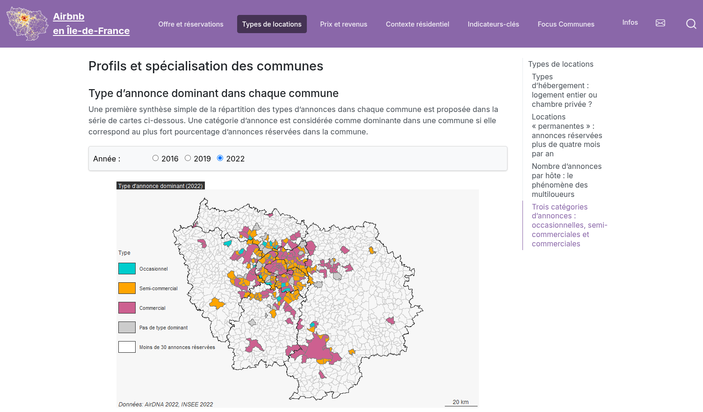{.bordered .w800}

<small>Au-delà des publications scientifiques, via sites Web dédiés par exemple</small>

:::

## Développement d'outils

 

**_Riatelab_** : l'activité de développement d'outils open source du RIATE

 

:::{.medium-small}
Des développements guidés par :

- la volonté de diffusion des méthodes de cartographie utilisées par le RIATE
- les besoins des projets de recherche auxquels participent des membres du RIATE

 

Mise en œuvres **des bonnes pratiques de développement logiciel** (*versioning*, tests, documentation, etc.)

 

Inscription dans la **dynamique de valorisation des logiciels produits par/pour des organismes publics**
(code.gouv.fr, SILL, Catalogue des logiciels libres de la recherche académique, etc.)

:::

## Développement d'outils : packages R

:::{.center}
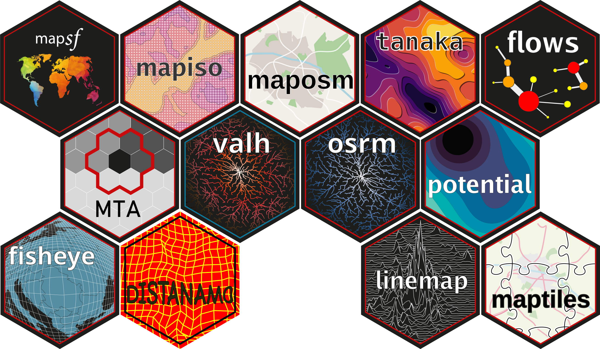{.w900}
:::

## Développement d'outils : packages R

 

- Des packages couvrant une **large variété de sujets**

 

- **Publiés sur le CRAN et/ou Runiverse** (+ code source sur GitHub)

 

- Des "vignettes" couvrant l'usage des packages, mais aussi des tâches
  préalables parfois bloquantes pour certains utilisateurs (installation de moteur de recherche d'itinéraire
  comme OSRM ou Valhalla, etc.)

## Développement d'outils : packages R

Exemple combinant plusieurs packages R développés par le RIATE

- **maposm** : récupération de couches extraites d'OpenStreetMap

- **valh** : calcul d'itinéraire (client pour l'API de Valhalla)

- **distanamo** : cartogramme de distance

- **mapsf** : cartographie

:::{.center}
{.w500}
:::

## Développement d'outils : bibliothèques JavaScript

:::{.center}
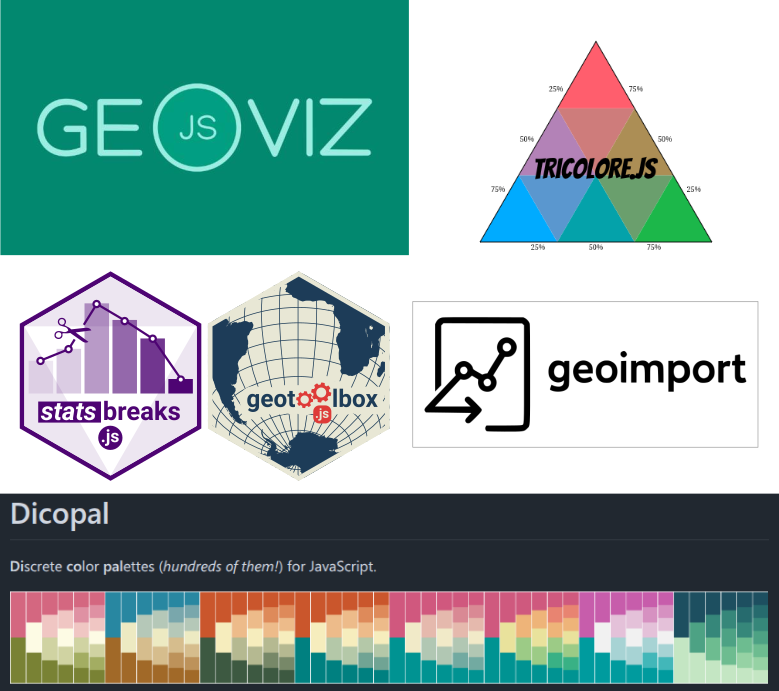{.w600}
:::

## Développement d'outils : bibliothèques JavaScript

- Bibliothèques publiées sur npmjs.com (+ code source sur GitHub)

- De nombreux notebooks et exemples d'utilisation sur la plateforme [Observable](https://observablehq.com/)

:::{.center}
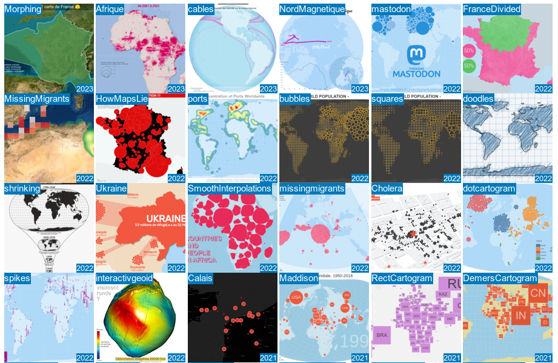{.w800}
:::

## Développement d'outils : Magrit

:::{.center}
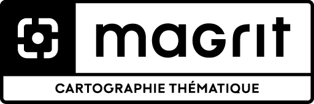{.w300}
:::

**Application Web de cartographie thématique**, développée au RIATE **depuis 2017** (le projet open source avec la plus
longue durée de vie au RIATE)

Utilisée pour l'**enseignement** et l'**apprentissage** de la cartographie, principalement à l'université

## Développement d'outils : Magrit

:::{.center}
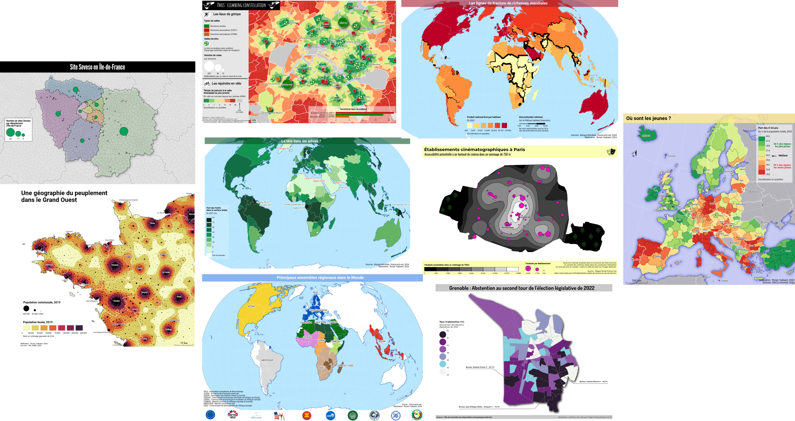{.w1000}
:::

## Développement d'outils : Varia

 

- Plugin QGIS, bibliothèques Rust ou Python, etc.

- Contribution à des projets open source externes.

- Et bien sûr, **des outils en cours de développement au sein de projets de recherche** 🕵️

:::{.center}
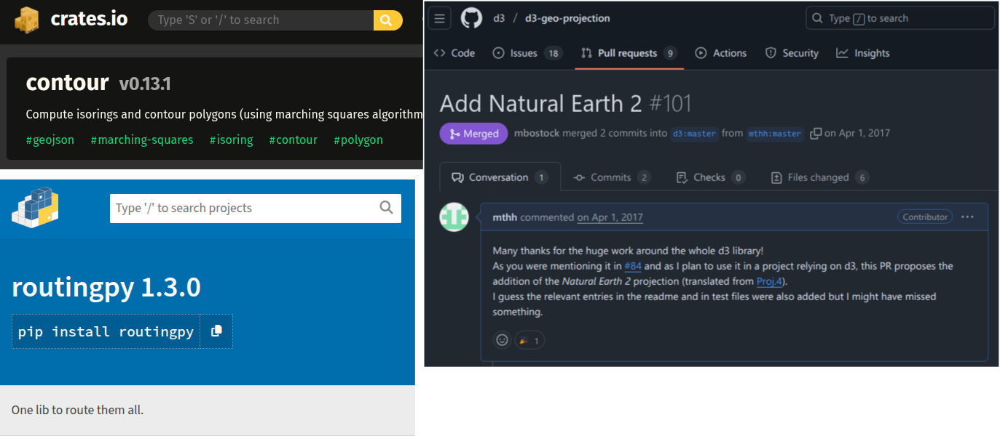{.w700}
:::

## Initiatives pour la diffusion des connaissances

Formation à la science ouverte et aux bonnes pratiques de la recherche reproductible

- École thématique [SIGR (Sciences de l'information géographique reproductibles)](https://sigr2020.sciencesconf.org/index.html) - 2023

- École thématique [SO-SHS (Sciences ouvertes pour les SHS : scripts, codes et logiciels)](https://so-shs.gitpages.huma-num.fr/) - 2025

:::{.center}
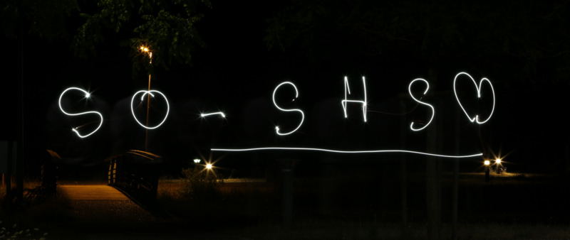{.w600}
:::

## Initiatives pour la diffusion des connaissances

*Un rôle d'organisation dans différentes initiatives*

:::{.medium-small}

- **RZine** ([https://rzine.fr/](https://rzine.fr/)) <!-- (publications en accès libre, soumises à une évaluation ouverte par les pairs) -->

- **ElementR** ([https://elementr.cnrs.fr/](https://elementr.cnrs.fr/)) <!--  (groupe pour l’apprentissage et la montée en compétence collective dans la pratique du traitement de l’information géo. avec R) -->

- Mise à disposition de supports complets sous licence libre (CC-BY-SA)
  - Géomatique et cartographie avec R ([https://rgeocarto.github.io/](https://rgeocarto.github.io/))
  - Théorie cartographie thématique + mise en pratique avec Magrit ([https://magrit-formation.github.io/](https://magrit-formation.github.io/))
  - (Géo)Visualisation en JavaScript

:::

:::{.center}
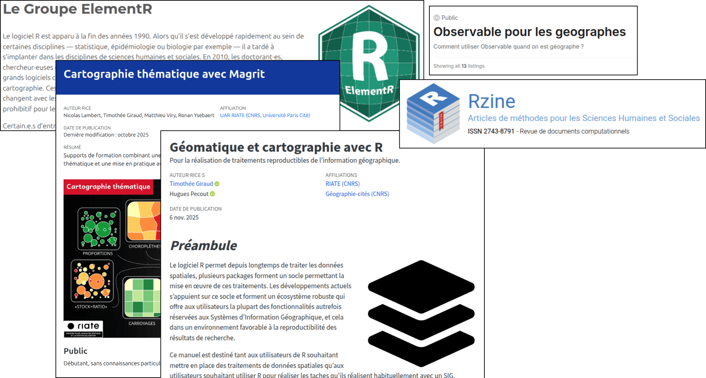{.w600}
:::

## Initiatives pour la diffusion des connaissances

*Une reconnaissance nationale et internationale*

 

- Implication dans des réseaux métiers (MATE-SHS, MAGIS, etc.)

- Solicitations pour intervenir dans des écoles thématiques (Bénin, Tunisie, Sénégal, Cambodge, etc.)

## Quel état de la diffusion réalisée par le RIATE ?

Bénéfices du choix de **méthodes reproductibles** :

- Des échanges facilités entre les chercheur·es et les ingénieur·es

- Des résultats faciles à diffuser et à réutiliser

- Une expertise reconnue en géographie quantitative et en conduite de projets

:::{.center}
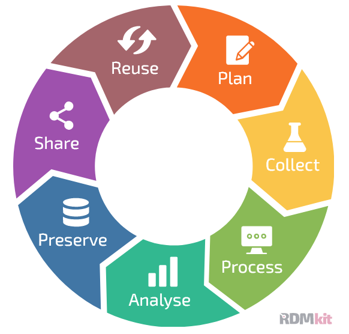{.w300}
:::

## Quel état de la diffusion réalisée par le RIATE ?

Bénéfices du choix des **logiciels libres** :

- Une **large diffusion des outils** (communauté d'utilisateurs internationale), des retours d'expérience et des rapports de bugs facilités

- Des **usages au-delà de la communauté _recherche_** (enseignement secondaire, collectivités territoriales, associations, hobbyistes, etc.)

:::{.center}
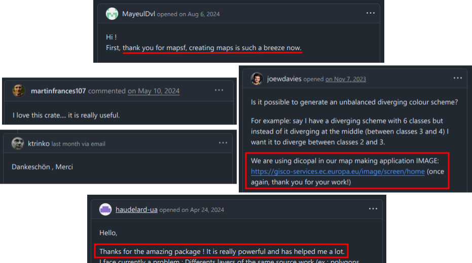{.w600}
:::

## 

Merci !